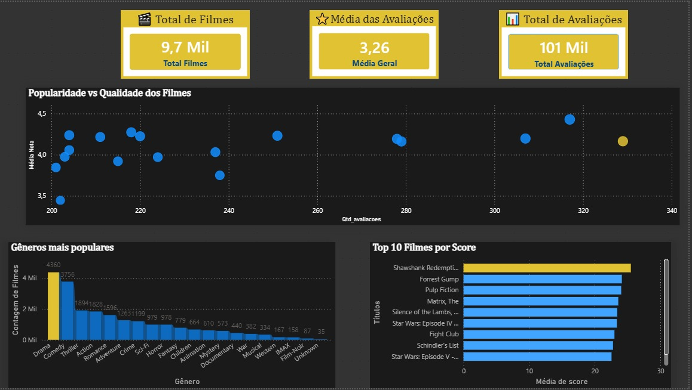

# 🎬 Análise de Filmes: Popularidade vs Qualidade

Projeto de análise de dados desenvolvido com foco em entender a relação entre popularidade e qualidade de filmes, utilizando SQL e Power BI.

---

## 📌 Problema de Negócio

As plataformas de streaming enfrentam o desafio de recomendar filmes relevantes considerando tanto a popularidade quanto a qualidade das avaliações.

Apenas usar o número de avaliações pode favorecer conteúdos populares, enquanto considerar apenas a média pode destacar filmes com pouca confiabilidade estatística.

---

## 🎯 Objetivo

Analisar dados de filmes para identificar padrões de comportamento dos usuários e propor uma métrica que combine qualidade e volume de avaliações.

---

## 🛠️ Ferramentas Utilizadas

* Excel: tratamento e limpeza dos dados
* PostgreSQL: modelagem e análise de dados
* Power BI: visualização e dashboard

---

## ⚙️ Etapas do Projeto

* Tratamento de dados no Excel
* Modelagem e análise no PostgreSQL
* Criação de views analíticas
* Desenvolvimento de métricas (média e score)
* Construção do dashboard

---

## 📊 Dashboard

*(adicione o print aqui)*

```markdown

```

---

## 🧠 Principais Insights

* Popularidade não é sinônimo de qualidade
* Avaliações se concentram em notas intermediárias
* Filmes com poucas avaliações podem distorcer análises
* O uso de score melhora a confiabilidade das recomendações

---

## 📂 Estrutura do Projeto

```
analise-filmes/
│
├── .gitignore
│
├── dados/
│   ├── brutos/
│   └── tratados/
│
├── excel/
│   ├── movies_final/
│   └── rating_final/
│
├── powerbi/
│   └── dashboard.pbix
│
├── sql/
│   ├── setup.sql
│   ├── analises.sql
│   └── views.sql
│
├── .gitattributes
├── LICENSE
└── README.md
```

    
